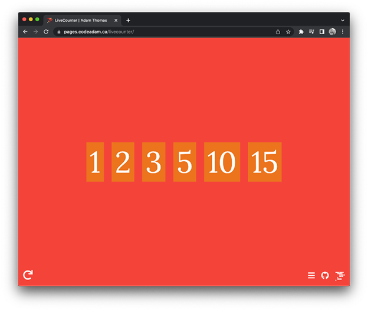

# LiveCounter

A basic web application that generates a countdown and a slideshow using programming memes based on a chosen topic. 

> LiveCounter is available to view at:  
> https://pages.codeadam.ca/livecounter/

***

## Repo Resources

* [Visual Studio Code](https://code.visualstudio.com/)
* [LiveCounter](https://pages.codeadam.ca/livecounter/)

